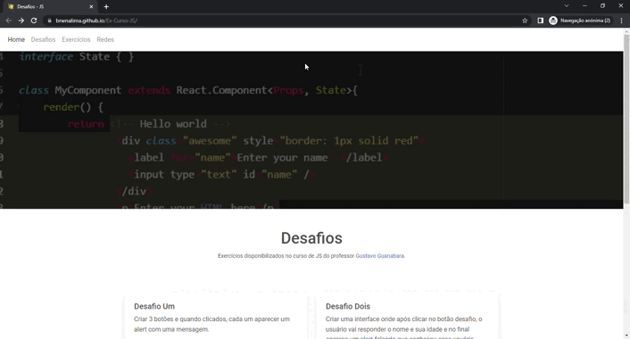

# Ex-Curso-JS
 
### Exercícios do curso de JavaScript pelo Curso em Vídeo - Gustavo Guanabara.

Repositório feito para a realização do curso de JavaScript, do <strong>[Curso em Vídeo](https://www.cursoemvideo.com/)</strong>.

Você consegue ver os meus exercícios e desafios, de modo prático, em meu deploy: [Desafios & Exercícios](https://brwnalima.github.io/Ex-Curso-JS/).

<div align='center'></img></div>


Veja também:

## Clone este repositório através do GIT:

```sh
$ git clone https://github.com/brwnalima/Ex-Curso-JS
```
